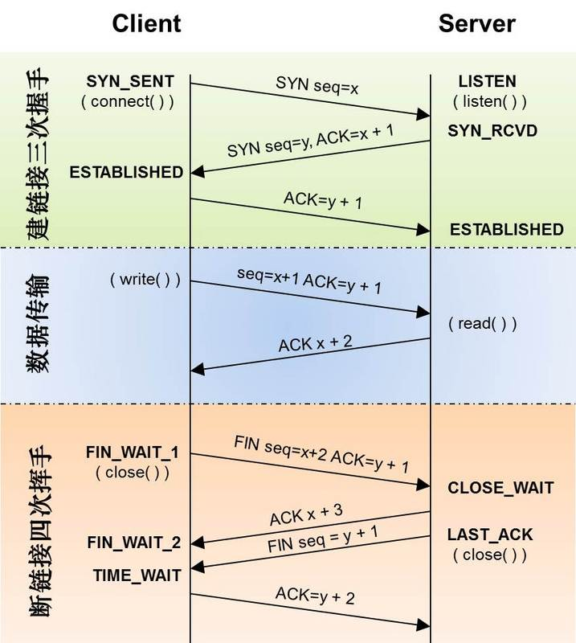

## 计算机网络功能：数据通讯，资源共享
 

## 计算机网络分类：
 

## 一些概念
### 带宽：发送端在发送数据时可达到的**最高**数据率（母鸡每秒生蛋的数量,只是理想的）。
### 吞吐量：单位时间内通过某个网络（信道，接口）的数据量。
### 时延：从一端到另一端所需时间。
- 发送时延= 数据长度/信道带宽    
**高速链路：指的是发送速率提高，并不会影响电磁波的传播速率**
- 传播时延= 信道长度/电磁波在信道上的传播速率(只受传播介质的影响)
- 排队时延，处理时延=  （安检排队）
- 时延带宽积（某段链路现在有多少bit）：

## 7层网络
上三层（应用会话表示层）：实现资源共享的设备和软件的集合
 

## OSI和TCP/IP异同？
同：都分层，都实现异构网络的互联
异：
- OSI定义三点：服务、协议、接口
- OSI的参考模型优于协议的发明，不偏向特定的协议
- 
|| ISO/OSI | TCP/IP |
|--|--|--|
网络层 | 面向无连接，面向连接 | 面向无连接(基于IP协议)
传输层 | 面向连接 | 面向无连接，面向连接

两个结合的5层参考模型：
 

## TCP 与 UDP 的区别

**TCP的可靠体现在TCP在传递数据之前，会有三次握⼿来建⽴连接，⽽且在数据传递时，有确认、窗⼝、重传、拥塞控制机制，在数据传完后，还会断开连接⽤来节约系统资源.**

运输层上面的几层，有很多服务是基于tcp的也有很多是基于udp的，也有两个都基于的。

###  TCP 协议如何保证可靠传输

- 1. 应⽤数据被分割成 TCP 认为最适合发送的数据块。
- 2. TCP 给发送的每⼀个包进⾏编号，接收⽅对数据包进⾏排序，把有序数据传送给应⽤层。
- 3. 校验和： TCP 将保持它⾸部和数据的检验和。这是⼀个端到端的检验和，⽬的是检测数据在传输过程中的任何变化。如果收到段的检验和有差错，TCP 将丢弃这个报⽂段和不确认收到此报⽂段。
- 4. TCP 的接收端会丢弃重复的数据。
- 5. **流量控制**： TCP 连接的每⼀⽅都有固定⼤⼩的缓冲空间，TCP的接收端只允许发送端发送接收端缓冲区能接纳的数据。当接收⽅来不及处理发送⽅的数据，能提示发送⽅降低发送的速率，防⽌包丢失。TCP 使⽤的流量控制协议是可变⼤⼩的**滑动窗⼝**协议。 （TCP 利⽤滑动窗⼝实现流量控制）
- 6. **拥塞控制**： 当⽹络拥塞时，减少数据的发送。
- 7. **ARQ协议**： 也是为了实现可靠传输的，它的基本原理就是每发完⼀个分组就停⽌发送，等待对⽅确认。在收到确认后再发下⼀个分组。
- 8. **超时重传**： 当 TCP 发出⼀个段后，它启动⼀个定时器，等待⽬的端确认收到这个报⽂段。如果不能及时收到⼀个确认，将重发这个报⽂段。

> **ARQ协议**:⾃动重传请求（Automatic Repeat-reQuest，ARQ）是OSI模型中数据链路层和传输层的错误纠正协议之⼀。它通过使⽤确认和超时这两个机制，在不可靠服务的基础上实现可靠的信息传输。如果发送⽅在发送后⼀段时间之内没有收到确认帧，它通常会重新发送。ARQ包括停⽌等待ARQ协议和连续ARQ协议。
停止等待ARQ：出错就超时重传。 （优点：简单  缺点：信道利⽤率低，等待时间⻓ ）   
连续ARQ：（优点： 信道利⽤率⾼，容易实现，即使确认丢失，也不必重传。   缺点： 不能向发送⽅反映出接收⽅已经正确收到的所有分组的信息。）

### TCP沾包，半包

什么时候需要考虑沾包半包：

- 1、如果利用tcp每次发送数据，就与对方建立连接，然后双方发送完一段数据后，就关闭连接，这样就不会出现粘包问题（因为只有一种包结构,类似于http协议）。

- 2、如果发送数据无结构，如文件传输，这样发送方只管发送，接收方只管接收存储就ok，也**不用考虑**粘包、

  发送方发送的ab cd ，而接受方接收的是abcd，沾在一起了。

- 3、**如果双方建立连接，需要在连接后一段时间内发送不同结构数据**，如连接后，有好几种结构：

  1)"hellogive me sth abour yourself"

  2)"Don'tgive me sth abour yourself"

  那这样的话，如果发送方连续发送这个两个包出去，接收方一次接收可能会是"hellogive me sth abour yourselfDon't give me sth abour yourself"这样接收方就傻了，到底是要干嘛？

原因:

- 发送方每次写入数据 < 套接字(Socket)缓冲区大小
- 接收方读取套接字(Socket)缓冲区数据不够及时

**根本原因：TCP 是流式协议，消息无边界。**UDP 虽然也可以一次传输多个包或者多次传输一个包，但每个消息都是有边界的，因此不会有粘包和半包问题。

NIO解决方案：封装成帧。也就是原本发送消息的单位是缓冲大小，现在换成了帧，这样我们就可以自定义边界了

> 半包与沾包相反。

### TCP三次握手，四次挥手

#### 三次握手过程

- 第一次握手：建立连接。客户端发送连接请求报文段，将SYN位置为1，Sequence Number为x；然后，客户端进入SYN_SEND状态，等待服务器的确认；
- 第二次握手：服务器收到SYN报文段。服务器收到客户端的SYN报文段，需要对这个SYN报文段进行确认，设置Acknowledgment Number为x+1(Sequence Number+1)；同时，自己自己还要发送SYN请求信息，将SYN位置为1，Sequence Number为y；服务器端将上述所有信息放到一个报文段（即SYN+ACK报文段）中，一并发送给客户端，此时服务器进入SYN_RECV状态；
- 第三次握手：客户端收到服务器的SYN+ACK报文段。然后将Acknowledgment Number设置为y+1，向服务器发送ACK报文段，这个报文段发送完毕以后，客户端和服务器端都进入ESTABLISHED状态，完成TCP三次握手。

#### 四次挥手

- 第一次挥手：主机1（可以使客户端，也可以是服务器端），设置Sequence Number和Acknowledgment Number，向主机2发送一个FIN报文段；此时，主机1进入FIN_WAIT_1状态；这表示主机1没有数据要发送给主机2了；
- 第二次挥手：主机2收到了主机1发送的FIN报文段，向主机1回一个ACK报文段，Acknowledgment Number为Sequence Number加1；主机1进入FIN_WAIT_2状态；主机2告诉主机1，我“同意”你的关闭请求；
- 第三次挥手：主机2向主机1发送FIN报文段，请求关闭连接，同时主机2进入LAST_ACK状态；
- 第四次挥手：主机1收到主机2发送的FIN报文段，向主机2发送ACK报文段，然后主机1进入TIME_WAIT状态；主机2收到主机1的ACK报文段以后，就关闭连接；此时，主机1等待2MSL后依然没有收到回复，则证明Server端已正常关闭，那好，主机1也可以关闭连接了。

## DNS负载均衡

不知道大家有没有思考过一个问题: DNS返回的IP地址是否每次都一样？如果每次都一样是否说明你请求的资源都位于同一台机器上面，那么这台机器需要多高的性能和储存才能满足亿万请求呢？其实真实的互联网世界背后存在成千上百台服务器，大型的网站甚至更多。但是在用户的眼中，它需要的只是处理他的请求，哪台机器处理请求并不重要。DNS可以返回一个合适的机器的IP给用户，例如可以根据每台机器的负载量，该机器离用户地理位置的距离等等，这种过程就是DNS负载均衡，又叫做DNS重定向。大家耳熟能详的CDN(Content Delivery Network)就是利用DNS的重定向技术，DNS服务器会返回一个跟用户最接近的点的IP地址给用户，CDN节点的服务器负责响应用户的请求，提供所需的内容。

## 幂等
**幂等性是数学中的一个概念，表达的是N次变换与1次变换的结果相同。** 答GET与POST区别可以答到这点!!!
GET、DELETE、PUT都会产生**相同的副作用**（并不是不代表每次返回结果相同），都是幂等的。
POST不具备幂等性(两次相同的POST请求会在服务器端创建两份资源，它们具有不同的URI；所以，POST方法不具备幂等性。)

**如何保证:** 1. 在请求之前获取一个token,返回给前端一个自己存一个在redis缓存,真正请求时删除掉redis中的token,后面的请求就都是无效的了.
2.使用乐观锁

# HTTP
http是一种面向资源的应用层协议，但对HTTP协议的使用实际上存在着两种不同的方式：一种是**RESTful**的，它把HTTP当成应用层协议，比较忠实地遵守了HTTP协议的各种规定；另一种是**SOA**的，它并没有完全把HTTP当成应用层协议，而是把HTTP协议作为了传输层协议，然后在HTTP之上建立了自己的应用层协议。

## IP分类

记住**128.000~191.255**是B类就行了

## 交换机与网桥

交换机可以为每个端口分配相同带宽，网桥不是

ARP和RARP工作在链路层，但属于**网络层协议**